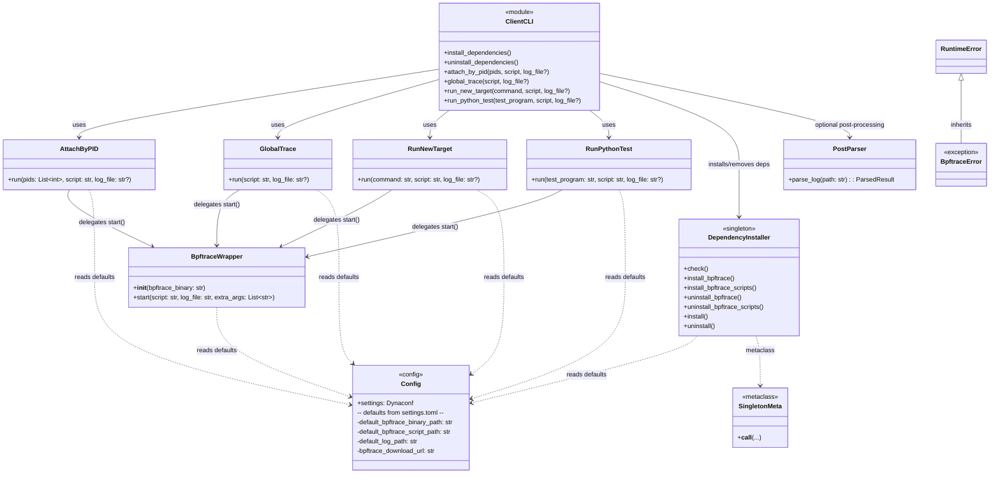
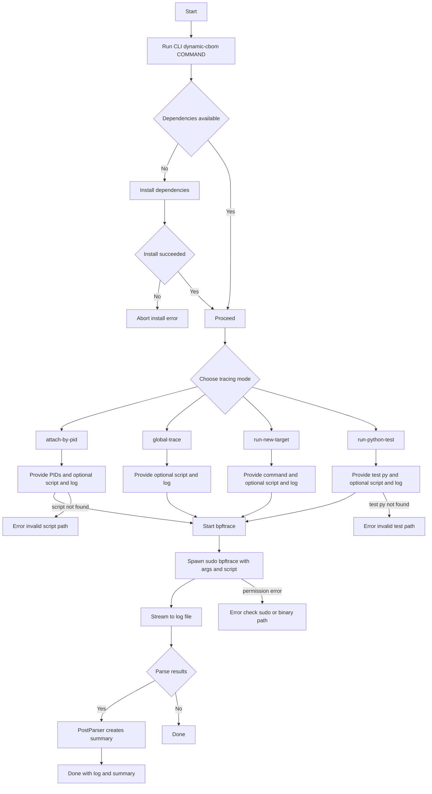
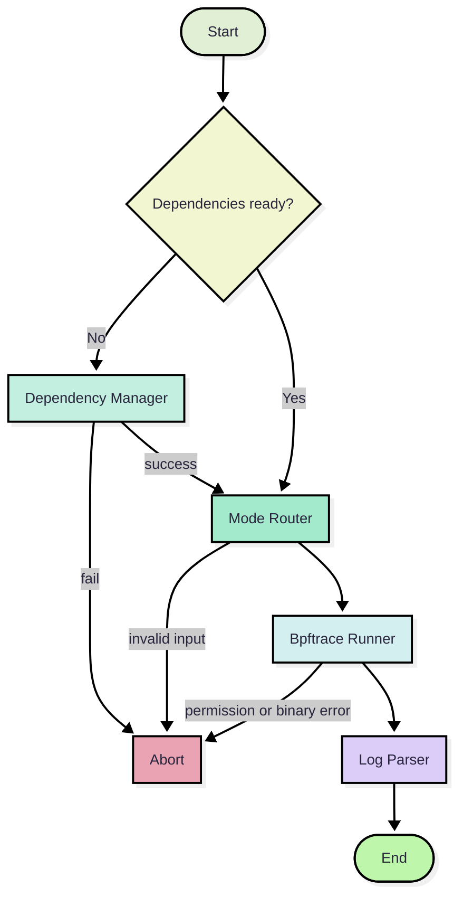
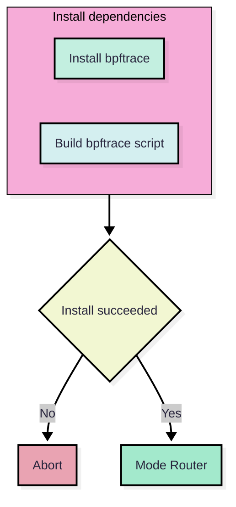
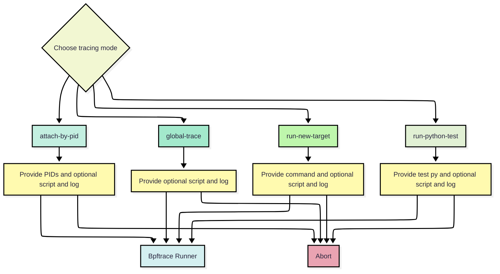
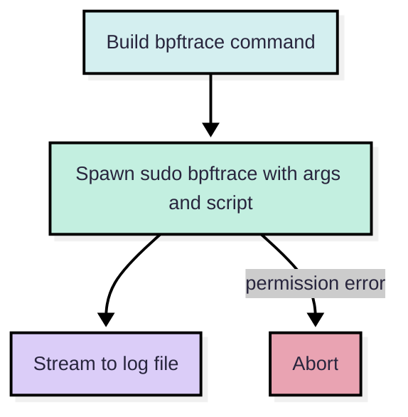
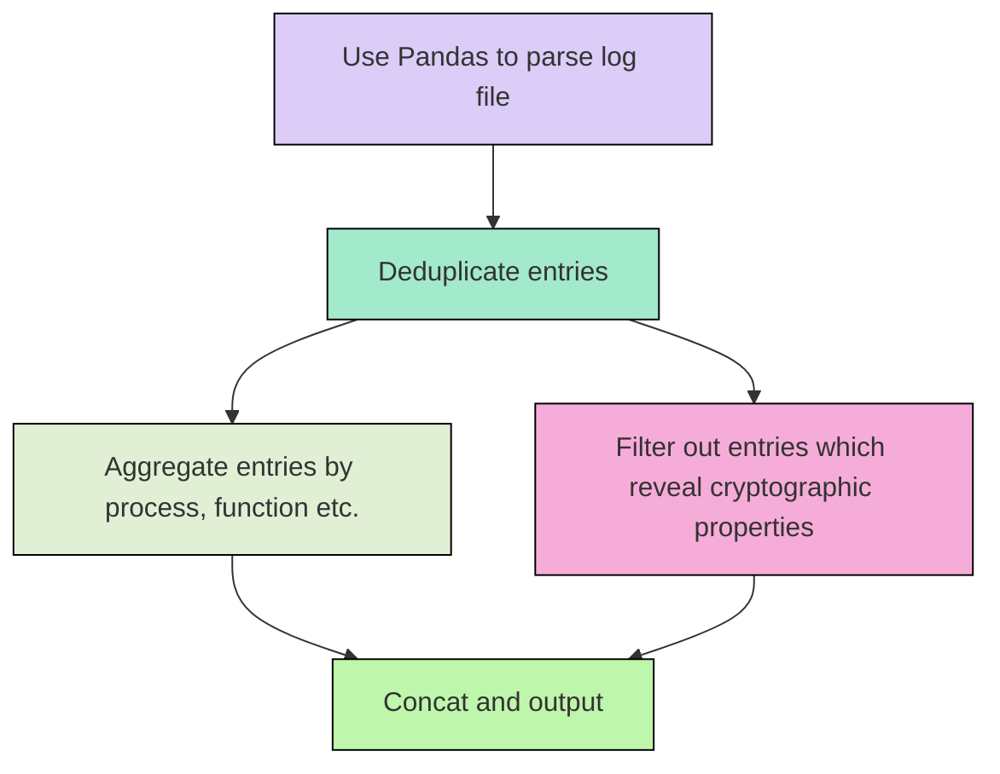

## Introduction

**Dynamic CBOM** is an experimental software for testing the feasibility of extracting **Cryptography Bill of Materials  (CBOM)** at runtime. It's lightweight, non-invasive, and designed for real-world tracing on Linux systems.

It essentially uses [bpftrace](https://bpftrace.org/) to dynamically trace the callings of cryptographic functions inside a program. To our current knowledge, it can effectively intercept all the callings for **OpenSSL** and other cryptography libraries implemented in C. Note that quite a lot cryptography libraries in other languages are just wrappers of OpenSSL, such as **Python Cryptography**. Hence, by tracing only OpenSSL, we are able to trace the usage of other cryptography libraries. 


## How does it work?

**bpftrace** is based on a concept [eBPF](https://ebpf.io/what-is-ebpf/). eBPF is a revolutionary technology with origins in the Linux kernel that can run sandboxed programs in a privileged context such as the operating system kernel. It is used to safely and efficiently extend the capabilities of the kernel without requiring to change kernel source code or load kernel modules. From the figure below, we can see that eBPF can also do Tracing task in user space, tracing some user space function calls. 

What eBPF does to intercept function calls is to **plant breakpoints** on a user space function in a binary or shared library.

bpftrace is a high-level tracing language for Linux and provides a quick and easy way for people to write observability-based eBPF programs, especially those unfamiliar with the complexities of eBPF.


## Prerequisite

- for simplicity, our implementation mainly focus on interception of OpenSSL 3.4 which is by default available in Ubuntu 25. 
- The repository is based on [uv](https://docs.astral.sh/uv/) which is a Python package and project manager. It needs to be installed firstly.

## Install

After cloning this repository, you can run:

```bash
curl -LsSf https://astral.sh/uv/install.sh | sh
sudo apt install make
uv build
uv pip install dist/dynamic_cbom-0.1.0-py3-none-any.whl
```

Then you should able to run dynamic-cbom command:

```bash
dynamic-cbom --help
```

## Class Diagram




## Workflow















