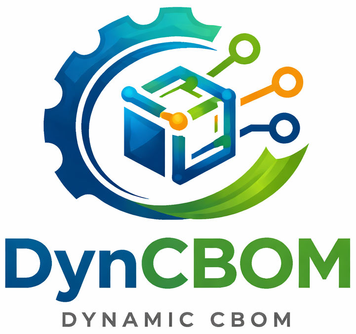

<div align="center">
  
  
  # DynamicCBOM
  
  **Runtime Cryptography Bill of Materials Extraction using eBPF**
  
  [](https://www.python.org/)
  [](https://www.linux.org/)
  [](LICENSE)
  [](https://ebpf.io/)

</div>

---

## 🎯 Overview

**DynamicCBOM** is an experimental software for extracting **Cryptography Bill of Materials (CBOM)** at runtime without code modification. It uses [bpftrace](https://bpftrace.org/) to dynamically trace cryptographic function calls via [eBPF](https://ebpf.io/) kernel technology.

### The Problem
Understanding what cryptographic operations your software uses is crucial for security audits, compliance, and vulnerability management. Traditional approaches require code analysis or expensive security assessments.

### The Solution
DynamicCBOM traces cryptographic functions at runtime, generating industry-standard CBOM documents in [CycloneDX 1.6](https://cyclonedx.org/guides/OWASP_CycloneDX-Authoritative-Guide-to-CBOM-en.pdf) format with minimal overhead and no code changes.

### Key Features

✨ **Non-invasive Runtime Tracing** - No code modification required  
🔍 **Comprehensive Coverage** - Intercepts OpenSSL 3.x and wrapper libraries (Python cryptography, Node.js crypto, etc.)  
📊 **Standards Compliant** - CycloneDX 1.6 CBOM format  
🎨 **Publication-Quality Visualizations** - Comparison charts with precision/recall/F1 metrics  
🔧 **Multiple Tracing Modes** - Attach to existing processes, system-wide, or run new targets  
⚡ **Fast & Lightweight** - eBPF-based with minimal performance impact  
🛡️ **No Dependencies Modification** - Traces production binaries as-is  

---

## 🚀 Quick Start (30 seconds)

### Installation
Currently, DynamicCBOM is tested on Ubuntu 25.04. The main reason for choosing this Ubuntu version is that it is installed with newer version of OpenSSL by default (OpenSSL 3.4.1). The tool is version-sensitive on OpenSSL. Different versions may have slight effect on performance.
```bash
# 1. Install uv package manager
curl -LsSf https://astral.sh/uv/install.sh | sh

# 2. Clone and setup
git clone https://github.com/your-org/DynamicCBOM.git
cd DynamicCBOM

# 3. Install system dependencies
sudo apt install make

# 4. Build and install
uv build
uv pip install dist/dynamic_cbom-0.1.0-py3-none-any.whl

# 5. Install bpftrace
dynamic-cbom install-dependencies

# 6. Verify
dynamic-cbom --help
```

### First Example

```bash
bash ./src/tests/testall.sh
```

**That's it!** You now have:
- `cbom.json` - CycloneDX CBOM document
- `comparison.png` - Accuracy metrics vs ground truth

---

## 🔧 How It Works

### The eBPF Technology Stack

```
Your Program (any language)
    ↓
OpenSSL/libcrypto (C library)
    ↓
eBPF uprobe (kernel-level intercept)
    ↓
bpftrace (tracing engine)
    ↓
Trace log (CSV events)
    ↓
DynamicCBOM post-processor
    ↓
CycloneDX CBOM JSON + visualizations
```

### Why eBPF?

| Feature | Benefit |
|---------|---------|
| **Kernel-level** | Can trace any binary without modification |
| **Sandboxed** | Runs in kernel sandbox, no privilege escalation |
| **Minimal overhead** | Only intercepts function entry/exit |
| **No module loading** | Pure kernel feature, no kernel modules needed |
| **Production-safe** | Used by Netflix, Google, Cloudflare for monitoring |

### Supported Crypto Libraries

DynamicCBOM traces **OpenSSL 3.x** directly. Since many crypto libraries are wrappers around OpenSSL, you get coverage for:

- ✅ **C/C++**: OpenSSL, GnuTLS
- ✅ **Python**: cryptography, pyOpenSSL, hashlib
- ✅ **Node.js**: crypto, TweetNaCl.js
- ✅ **Java**: BouncyCastle (via OpenSSL bridge)
- ✅ **Go**: crypto/sha, crypto/rsa (if using OpenSSL)
- ✅ **Rust**: ring, openssl crates

---


## 📊 System Requirements

| Requirement | Details |
|-------------|---------|
| **OS** | Linux (Ubuntu 20.04+, Debian 11+, RHEL 8+) |
| **Kernel** | 4.8+ (for eBPF support) |
| **Python** | 3.12 or later |
| **Privileges** | sudo access (required for bpftrace) |
| **Disk** | ~500MB free |
| **Memory** | 2GB+ recommended |

**Limitations:**
- ⚠️ WSL2 and containers may have limited eBPF support
- ⚠️ Requires kernel built with eBPF enabled (most modern distros have this)
- ⚠️ Some cloud providers disable eBPF by default


## 📊 Output Format (CycloneDX CBOM)

DynamicCBOM generates industry-standard CBOM documents:

```json
{
  "bomFormat": "CycloneDX",
  "specVersion": "1.6",
  "version": 1,
  "metadata": {
    "timestamp": "2024-01-06T12:00:00Z",
    "tools": [
      {
        "vendor": "DynamicCBOM",
        "name": "DynamicCBOM",
        "version": "0.1.0"
      }
    ]
  },
  "components": [
    {
      "type": "cryptographic-asset",
      "bom-ref": "asset-1",
      "name": "EVP_PKEY_encrypt",
      "cryptoProperties": {
        "assetType": "algorithm",
        "algorithmProperties": {
          "primitive": "asymmetric",
          "cryptoFunctions": ["encrypt"],
          "parameterSetIdentifier": "2048"
        }
      }
    }
  ]
}
```

### Comparison Metrics

When comparing two CBOMs (dynamic vs ground truth), DynamicCBOM calculates:

- **Precision** = TP/(TP+FP) - Of detected assets, how many were correct?
- **Recall** = TP/(TP+FN) - Of actual assets, how many were detected?
- **F1-Score** = 2×P×R/(P+R) - Harmonic mean (overall accuracy)

Higher scores = better CBOM extraction.

---

## 🔍 Available Probes

| Probe | Target | Algorithms | Use Case |
|-------|--------|-----------|----------|
| `symmetric.bt` | Symmetric encryption | AES, DES, ChaCha20, Blowfish | Encrypt/decrypt tracing |
| `asymmetric.bt` | Public-key crypto | RSA, ECC, ECDSA, EdDSA | Key generation & signing |
| `hashing.bt` | Hash functions | SHA-1, SHA-2, SHA-3, MD5 | Digest computation |
| `tls.bt` | TLS/SSL operations | TLS handshake, record layer | HTTPS/TLS monitoring |
| `algorithms.bt` | All algorithms | Combined (largest) | Comprehensive tracing |

Choose based on your needs:
- **Development/Testing** → `algorithms.bt` (comprehensive)
- **Production/Performance** → Specific probe (smaller overhead)
- **Focused Analysis** → Target probe (symmetric, asymmetric, etc.)

---

## 🛡️ Security & Design Philosophy

✅ **Non-Invasive** - Pure observation, no code changes  
✅ **Sandboxed** - eBPF runs in kernel sandbox  
✅ **Minimal Overhead** - Only uprobes at function entry  
✅ **Local Processing** - All data stays on your machine  
✅ **Open Source** - MIT Licensed, auditable code  
✅ **Production-Ready Design** - Used by major companies (Netflix, Google, etc.)

---

## 🐛 Troubleshooting

### Installation Issues

**"bpftrace: command not found"**
```bash
# Automatic installation
dynamic-cbom install-dependencies
```

**"ModuleNotFoundError: No module named 'typer'"**
```bash
# Reinstall dependencies
cd src && uv sync
```

### Tracing Issues

**"Permission denied" when running bpftrace**
```bash
# Dynamic-cbom automatically uses sudo
# Ensure you have sudo access:
sudo -l

# May need to enter password for first command
```

**No events captured in trace log**
```bash
# 1. Verify process uses OpenSSL
ldd $(which myapp) | grep libcrypto

# 2. Verify OpenSSL 3.x is installed
openssl version

# 3. Check process is actually using crypto
# Run with strace if needed: strace ./myapp
```

**"Error: kernel doesn't support... uprobe"**
- Your kernel may not support eBPF uprobes
- Check kernel version: `uname -r` (need 4.8+)
- Some containers/VMs have limited eBPF support


---

## 🤝 Contributing

We welcome contributions! To contribute:

1. **Fork** the repository
2. **Create** a feature branch: `git checkout -b feature/my-feature`
3. **Code** with PEP 8 style, add docstrings
4. **Test** your changes
5. **Commit** with clear messages: `git commit -m 'Add my feature'`
6. **Push** to your fork: `git push origin feature/my-feature`
7. **Open** a Pull Request

### Development Setup

```bash
cd src
uv sync              # Install dev dependencies
# Make changes...
uv run pytest        # Run tests (if available)
```

---


<div align="center">

### Made with ❤️ for the Security & Cryptography Community

**[⬆ Back to Top](#dynamiccbom)**


</div>
