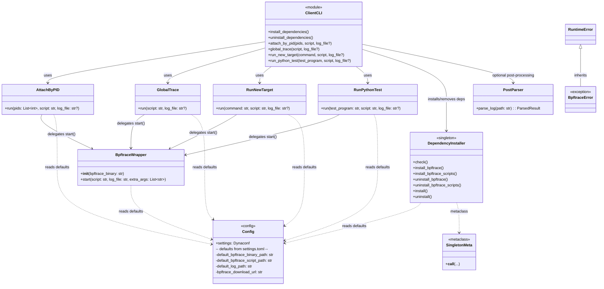
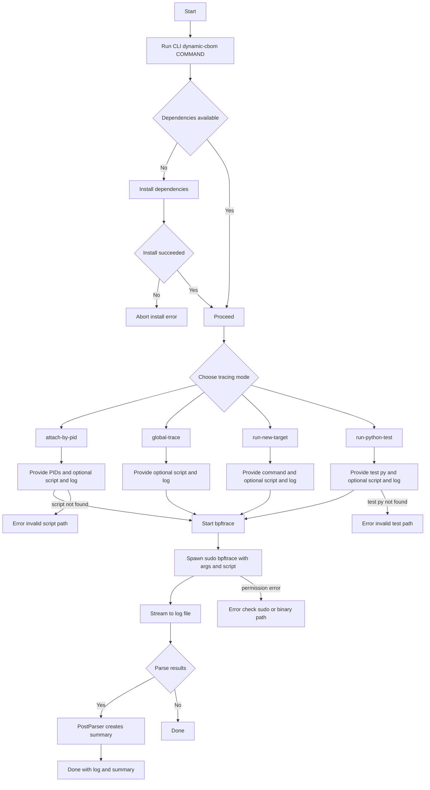
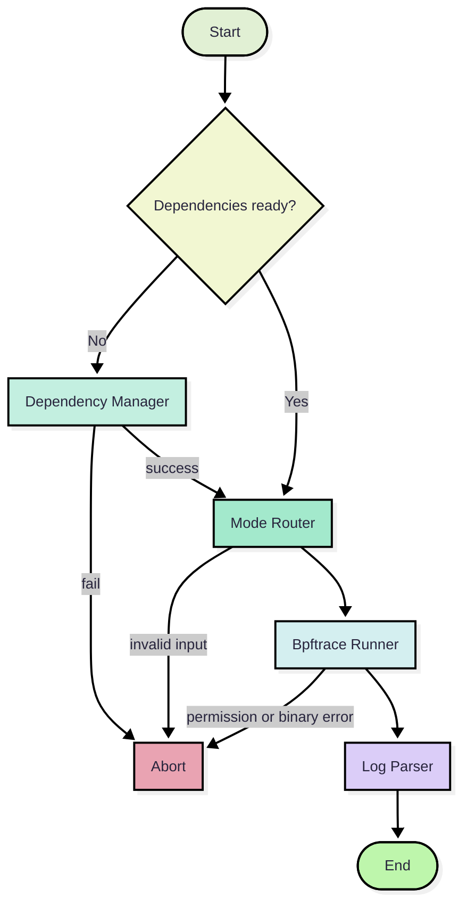
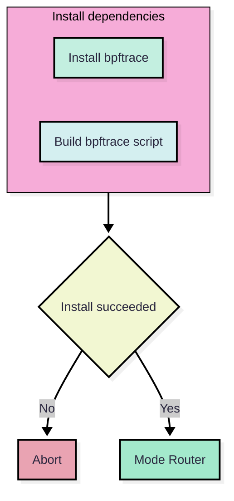
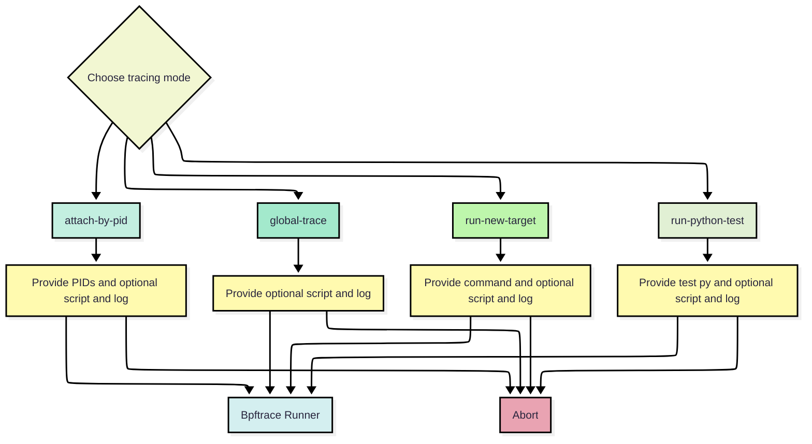
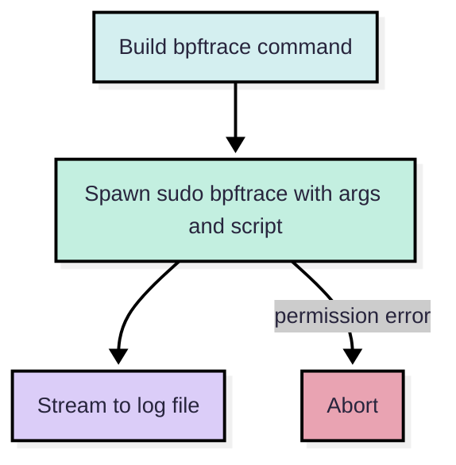
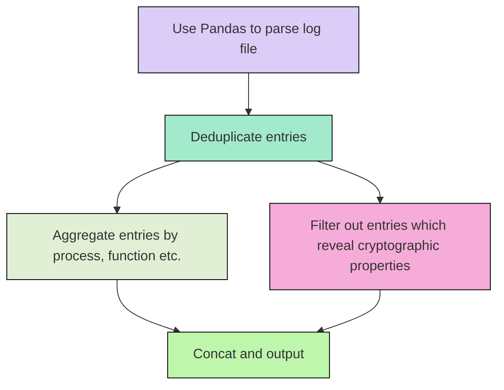

<div align="center">
  
  
  # DynamicCBOM
  
  **Runtime Cryptography Bill of Materials Extraction using eBPF**
  
  [](https://www.python.org/)
  [](https://www.linux.org/)
  [](LICENSE)
  [](https://pdoc.dev/)

</div>

## 🎯 Overview

**DynamicCBOM** is an experimental software for extracting **Cryptography Bill of Materials (CBOM)** at runtime. It's lightweight, non-invasive, and designed for real-world tracing on Linux systems.

Using [bpftrace](https://bpftrace.org/) to dynamically trace cryptographic function calls, DynamicCBOM effectively intercepts **OpenSSL 3.x** library calls. Since many cryptography libraries in other languages are wrappers around OpenSSL (e.g., Python's `cryptography`, Node's `crypto`), tracing OpenSSL provides comprehensive coverage.

### Key Features

✨ **Non-invasive Runtime Tracing** - No code modification required  
🔍 **Comprehensive Coverage** - Tracks OpenSSL and wrapper libraries  
📊 **Standards Compliant** - CycloneDX 1.6 CBOM format  
🎨 **Publication-Quality Visualizations** - Comparison charts with metrics  
🔧 **Flexible Tracing Modes** - Attach to existing processes, system-wide, or run new targets  
⚡ **Fast & Lightweight** - eBPF-based with minimal overhead  

## 🚀 Quick Start

### Installation

```bash
# 1. Install uv package manager
curl -LsSf https://astral.sh/uv/install.sh | sh

# 2. Clone and setup
git clone https://github.com/your-org/DynamicCBOM.git
cd DynamicCBOM

# 3. Install system dependencies
sudo apt install make

# 4. Build and install
uv build
uv pip install dist/dynamic_cbom-0.1.0-py3-none-any.whl

# 5. Install bpftrace
dynamic-cbom install-dependencies

# 6. Verify installation
dynamic-cbom --help
```

### First Command (30 seconds)

```bash
# Trace a Python cryptography program
dynamic-cbom run-python-test ./src/testPrograms/cryptography_symmetric.py \
  --script ./src/probes/symmetric.bt \
  --log-file ./trace.log

# Generate CBOM
dynamic-cbom parse-log ./trace.log \
  --output-path ./cbom.json

# Compare with ground truth
dynamic-cbom generate-chart ./cbom.json \
  ./src/tests/ground_truth/symmetric_cbom_gt.json \
  --output-path ./comparison.png
```

## 🔧 How It Works

DynamicCBOM leverages **eBPF (Extended Berkeley Packet Filter)** and **bpftrace** to trace cryptographic operations:

```
Your Program (using OpenSSL)
           ↓
    eBPF uprobes intercept
    cryptographic function calls
           ↓
    bpftrace captures events
           ↓
    Trace log (CSV format)
           ↓
    DynamicCBOM post-processor
           ↓
    CycloneDX CBOM JSON
    + Word cloud visualization
```

**Why eBPF?**
- Runs in kernel space (sandboxed)
- No kernel module loading required
- Minimal performance overhead
- No source code modification needed

## 📋 Available Commands

| Command | Purpose | Use Case |
|---------|---------|----------|
| `banner` | Display logo | Verify installation |
| `install-dependencies` | Setup bpftrace | First-time setup |
| `attach-pid` | Trace existing process | Monitor running app |
| `global-trace` | System-wide tracing | Find all crypto usage |
| `run-new-target` | Run program + trace | Test new executable |
| `run-python-test` | Trace Python program | Test Python crypto |
| `parse-log` | Log → CBOM conversion | Process bpftrace output |
| `generate-chart` | CBOM comparison | Visualize results |

**Example:**
```bash
# Trace by process ID
dynamic-cbom attach-pid 12345 --script ./src/probes/algorithms.bt

# System-wide tracing
dynamic-cbom global-trace --script ./src/probes/tls.bt

# Run and trace (note the --)
dynamic-cbom run-new-target -- ./myapp --config config.json
```

## 📚 Documentation

### Getting Started
- **[Quick Start Guide](docs/QUICKSTART.md)** - 5-minute installation tutorial
- **[Installation Guide](docs/QUICKSTART.md#installation-steps)** - Detailed setup instructions

### Usage & Reference
- **[Command Reference](docs/COMMAND_REFERENCE.md)** - All 9 commands with examples
- **[User Guide](docs/USER_GUIDE.md)** - Comprehensive usage guide
- **[API Documentation](docs/API_REFERENCE.md)** - Function and class reference

### Understanding the System
- **[Architecture Guide](docs/ARCHITECTURE.md)** - System design and components
- **[Class Diagram](#class-diagram)** - Visual component structure

### Publishing & Distribution
- **[PyPI Guide](docs/PYPI_GUIDE.md)** - Publish to Python Package Index

## 📊 System Requirements

| Requirement | Details |
|-------------|---------|
| **OS** | Linux (Ubuntu 20.04+, Debian 11+) |
| **Kernel** | 4.8+ (for eBPF support) |
| **Python** | 3.12 or later |
| **Privileges** | sudo access (for bpftrace) |
| **Disk** | ~500MB free |

**Note:** WSL2 and containers may have limited eBPF support.

## 🛠️ Prerequisites

- **bpftrace**: Installed automatically via `dynamic-cbom install-dependencies`
- **uv**: Python package manager ([install](https://docs.astral.sh/uv/))
- **make**: Build tool (`sudo apt install make`)
- **OpenSSL 3.x**: Usually pre-installed on modern Linux

## 📦 Installation Methods

### Method 1: Direct from Source (Recommended)
```bash
uv build
uv pip install dist/dynamic_cbom-0.1.0-py3-none-any.whl
```

### Method 2: Using pip
```bash
cd src
pip install -e .
```

### Method 3: Docker (Alternative)
```bash
docker build -t dynamic-cbom .
docker run --privileged -it dynamic-cbom bash
```

## 🎓 Usage Examples

### Example 1: Trace a Running Process

```bash
# Find process
PID=$(pgrep -f myapp)

# Attach tracing
dynamic-cbom attach-pid $PID \
  --script ./src/probes/algorithms.bt \
  --log-file ./myapp_trace.log

# Process results
dynamic-cbom parse-log ./myapp_trace.log \
  --output-path ./myapp_cbom.json --verbose
```

### Example 2: Compare CBOMs

```bash
# Generate comparison chart
dynamic-cbom generate-chart \
  ./dynamic_cbom.json \
  ./ground_truth_cbom.json \
  --ibm-cbom-path ./ibm_cbom.json \
  --output-path ./comparison.png
```

### Example 3: Test Suite

```bash
# Run multiple tests
for test in src/testPrograms/*.py; do
  dynamic-cbom run-python-test "$test" \
    --script ./src/probes/algorithms.bt \
    --log-file "$(basename $test .py).log"
  dynamic-cbom parse-log "$(basename $test .py).log" \
    --output-path "$(basename $test .py).json"
done
```

## 🏗️ Architecture

DynamicCBOM uses a modular architecture with clear separation of concerns:

## Class Diagram




## Workflow















